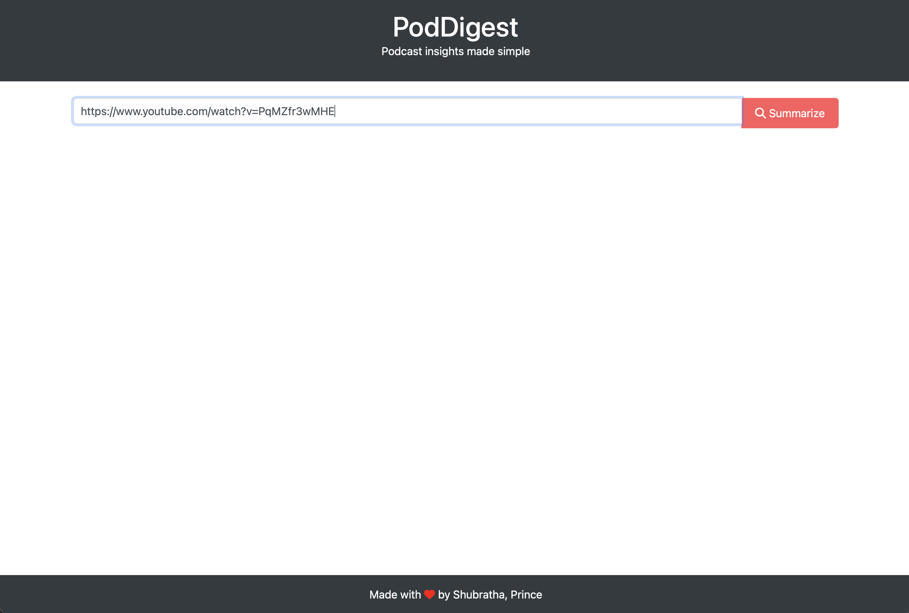
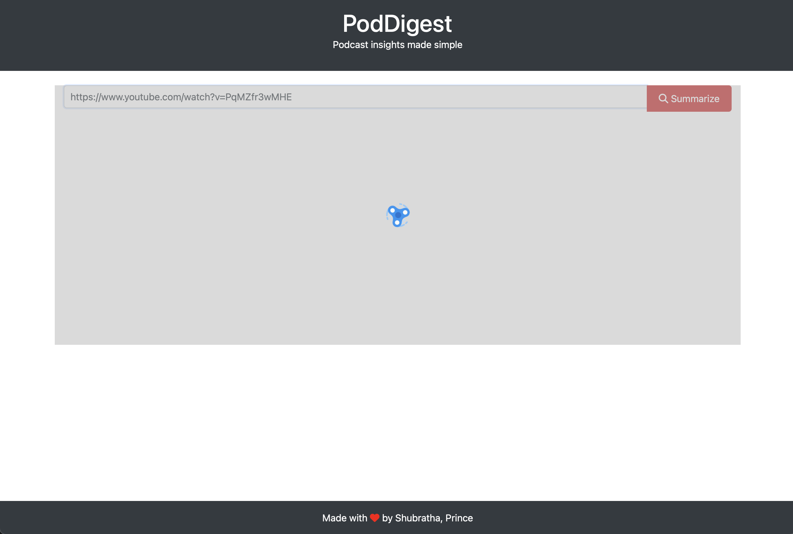
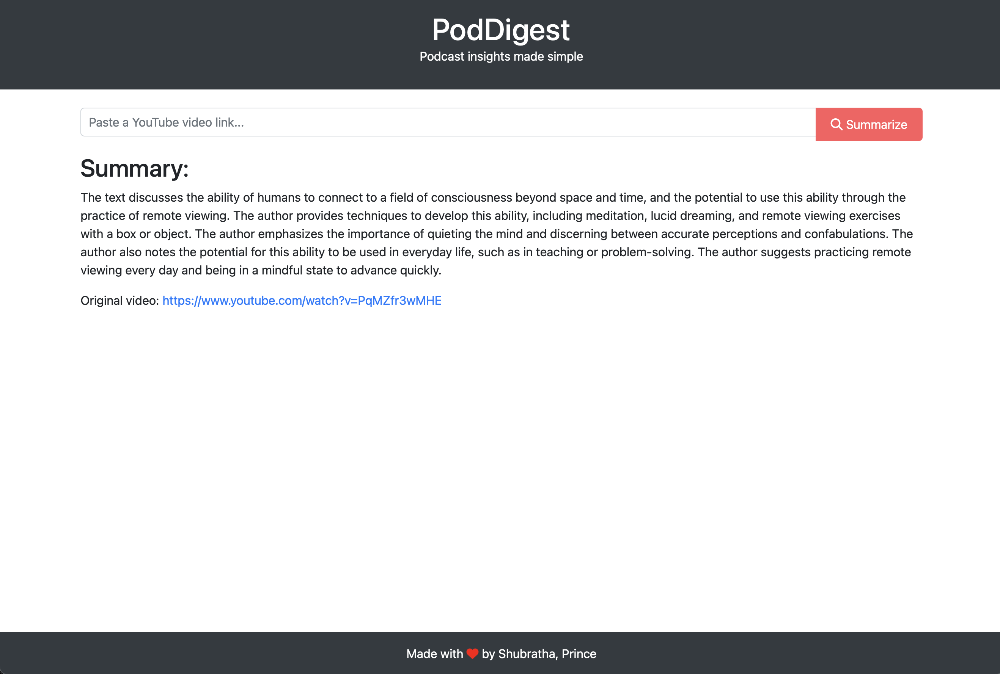

# Synopsis aka PodDigest

<p>
Podcasts are a popular medium for sharing information, ideas, and stories. However, many people find it difficult to keep up with the large amount of content available. This is where a podcast summary app comes in handy.
</p>
<p>
A summary app saves time by providing a concise summary of the main points of the episode. With PodDigest, a summary of any podcast can be obtained which allows users to quickly scan through episodes and select the ones that interest them.
</p>


## Tech Used
OpenAI, Whisper, PyTube, Flask

### Local Setup
1. Clone the repo
2. Create virtual env and activate it
3. cd to repo and install requirements
   ```python requirements.txt```
4. Run app
`flask run`
5. Go to [localhost](http://127.0.0.1:5000) on browser
6. Enter a youtube link and hit `summarize` to get summary of the podcast video

### Screenshots


